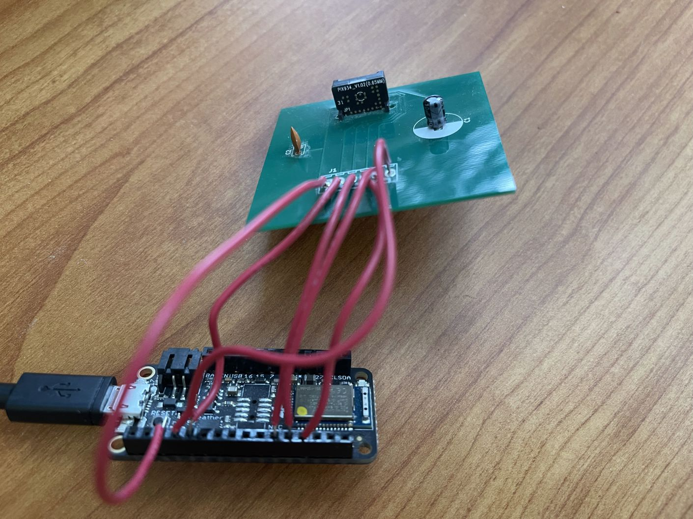

# PixArt PAJ7025R2 6dof Tracking Demo with Arduino and Windows

*Copyright 2017-2019 Bart Trzynadlowski*

## Overview

The PixArt PAJ7025R2 is an infrared camera with integrated DSP capable of tracking multiple IR light sources at high frame rates. Its predecessor was used in Nintendo's Wii Remote controller. [Johnny Chung Lee](http://johnnylee.net/projects/wii/), [Oliver Kreylos](https://web.cs.ucdavis.edu/~okreylos/ResDev/Wiimote/index.html  ), and [Franklin Ta](https://franklinta.com/2014/09/30/6dof-positional-tracking-with-the-wiimote/) have each demonstrated how to use the Wii sensor
for fun 6dof tracking applications.

In 2017, I got the idea to use the sensor in conjunction with Microsoft HoloLens for 6dof tracking of a tennis racket. I only got as far as
fabricating a test PCB to mount the chip before I shelved it. Two years later, feeling bad that I had never done anything with the boards, I built a PC
interface using Arduino and wrote a simple program to track and render an IR target in real-time.


This repository includes:

- Arduino code for the [Adafruit Feather nRF52 Bluefruit LE (nRF52832) board](https://www.adafruit.com/product/3406)
- Windows code for pose estimation (OpenCV 4.0.1) and visualization (SDL2 and OpenGL)
- PCB schematics and Gerbers files sent to [PCB Unlimited](https://pcbunlimited.com/) for fabrication
- Photographs of the assembled hardware, including a simple 9V battery-powered target with four 875 nm IR LEDs ([TSHA4400](https://www.vishay.com/ir-emitting-diodes/list/product-81017/)) by Vishay Semiconductors.

The Arduino reads out the detection report for each frame and sends it to the Windows program, which runs OpenCV's perspective-n-point (PnP) solver to estimate the 6dof pose of a target with known dimensions.

A PAJ7025R3 part with a wider field of view exists. To my knowledge, it is the exact same IC but with a different lens, meaning a simple modification of the camera
intrinsics in `code/win32/src/include/pixart/camera_parameters.hpp` would be the only change needed to support it.

## Build Instructions

### Arduino

The Arduino code is located in `code/arduino/pa_driver`. The other Arduino programs are simple tests. [Follow the instructions from Adafruit](https://learn.adafruit.com/bluefruit-nrf52-feather-learning-guide/arduino-bsp-setup) for
installing the BSP and loading the code onto the board.

Connections between the PixArt PCB and the Arduino board are listed in the table below.

| PixArt PCB | nRF52832 |
| ---------- | -------- |
| J1 (VDDMA) | +3.3v (recommend pin nearest GND) |
| J2 (G9/CSB) | A0 |
| J3 (G10/SCK) | SCK |
| J4 (G11/MISO) | MISO |
| J5 (G12/MOSI) | MOSI |
| J6 (GND) | GND |



### Windows

The Windows program located in `code/win32` depends on:

- [Boost](https://www.boost.org/) 1.69.0
- [OpenCV](https://opencv.org) 4.0.1
- [SDL2](https://libsdl.org)

Newer versions of Boost and OpenCV are untested but should work.

A Makefile for GCC on Windows is included. Edit the *Search Paths* section as needed. I used [MSYS2](https://msys2.org) to install GCC and SDL2 via pacman. OpenCV and Boost were installed manually.
Once ready simply run Make from the `code/win32` directory in an MSYS2 shell or Windows Command Prompt:

```
make
```

Visual Studio users will unfortunately have to manually create a project. I will happily accept a pull request for Visual Studio or CMake.

## Usage

In `code/win32` run:

```
bin/object_visualizer.exe
```

Two windows will appear (probably atop each other), one showing the raw objects detected by the sensor and the other showing a visualization of
a ping pong paddle in 3D. This assumes that an identical IR target to mine is being used. The target is defined in `code/win32/src/apps/object_visualizer/perspective_window.cpp`.
If there is an error opening the COM port, make sure the USB drivers were installed. These should come bundled with the Arduino IDE but can also
be obtained directly ([instructions here](https://learn.adafruit.com/bluefruit-nrf52-feather-learning-guide/arduino-board-setup)).

To test without any hardware, some recorded data is provided in `code/win32/recordings`. For example, try:

```
bin/object_visualizer.exe --replay-from=recordings/paddle0.bin
```

To learn about command line options, run:

```
bin/object_visualizer.exe --help
```

